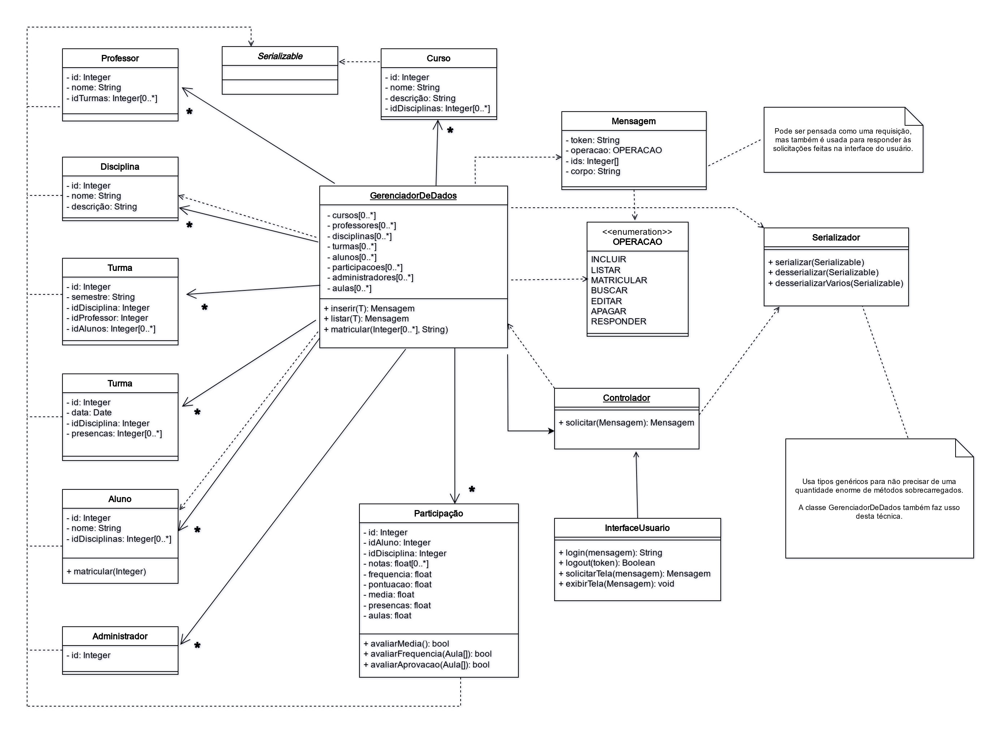

# aps-serial

Implementação de uma arquitetura de software utilizando serialização para diminuir o acoplamento entre as classes e tipos genéricos para aumentar o reuso de código.

Este trabalho foi desenvolvido para a Disciplina de Arquitetura e Programação de Software, do curso de Análise e Desenvolvimento de Sistemas do Instituto Federal de São Paulo, campus Jacareí.

- [Proposta](docs/prompts.md)
- [Relatório final](docs/entrega/02/JunoTakano-APSI5-exercicio_de_projeto.pdf)
- [Diagrama expandido](docs/entrega/02/img/class_200-light.drawio.png)
- [Diagrama expandido (escuro)](docs/entrega/02/img/class_200-dark.drawio.png)
- [Relatório de testes (zip)](docs/entrega/02/JunoTakano-APSI5-exercicio_de_projeto-testes.zip)
